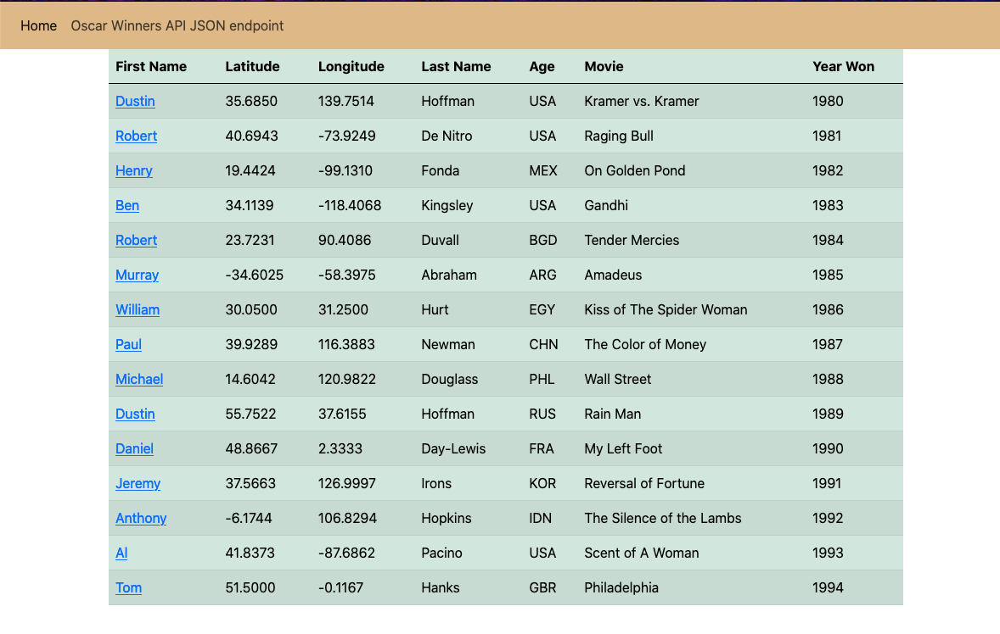

# Jeffrey Galicia

# Project Description
This is the final Web Application for IS218. The idea of this 
project is to implement the statistics project by making 
API endpoints and displaying the data through a JavaScript Chart.

